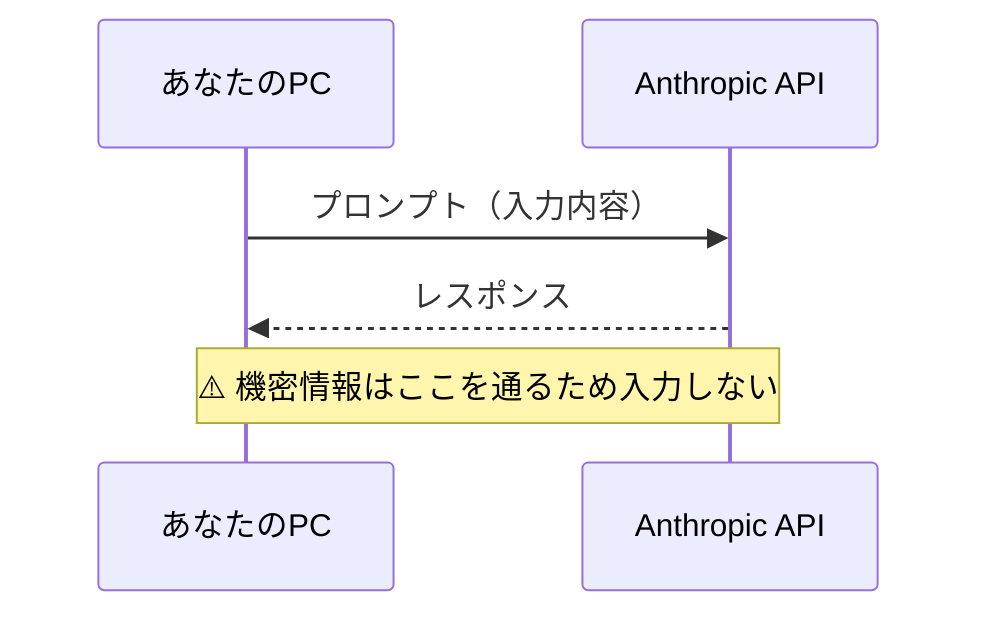
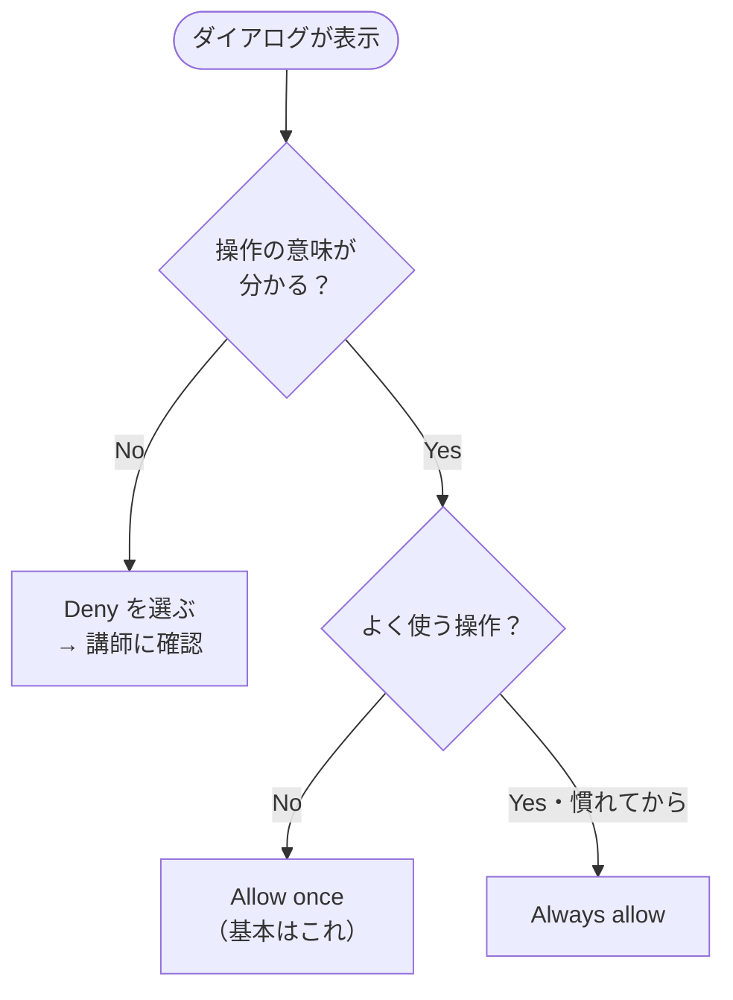
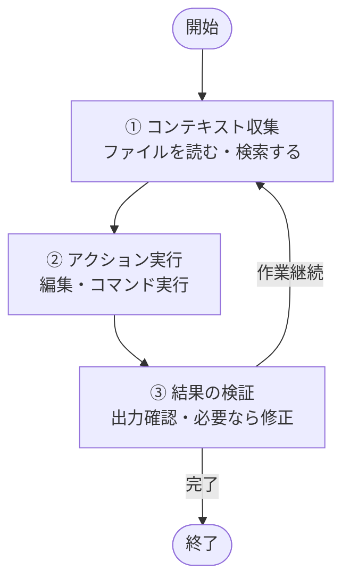
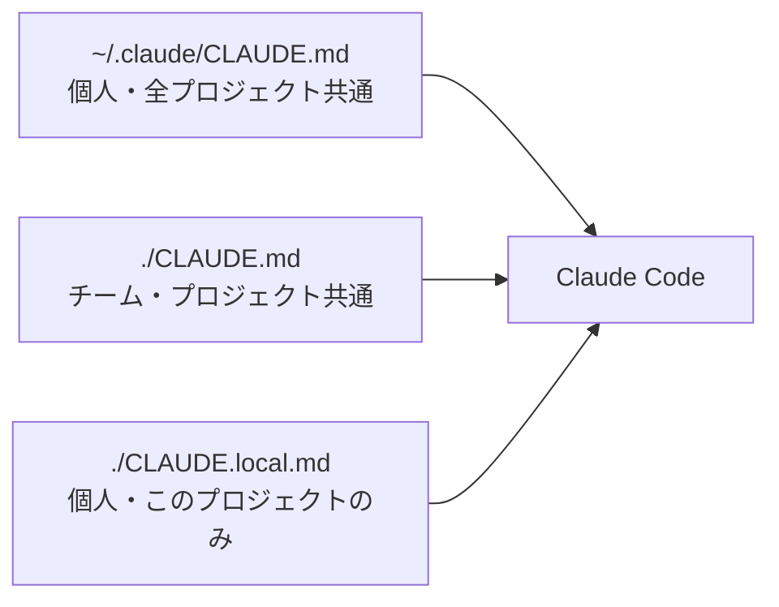
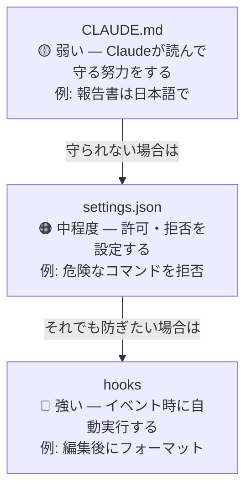

# Claude Code 法人向けハンズオン研修

> - **研修時間**: 合計 15 時間（5 時間 × 3 回）
> - **対象者**: 生成 AI を業務に活用したい企業の社員
> - **前提条件**: Windows または Mac のパソコン。社内手続きに従い Claude（Anthropic）の利用が可能なこと。研修開始までに下記「事前準備」を済ませ、`claude` と入力して Claude Code が起動する状態であること

---

## この研修でできるようになること

本研修では、Claude Code を使って業務ファイルの作成・整理・改善を安全に進める方法を学びます。

終了時には、以下ができる状態を目指します。

1. Claude Code が何で、普通のチャット AI と何が違うかを説明できる
2. 法人利用で守るべきセキュリティ境界を理解し、安全に使える
3. ファイル作成・読取・編集・コマンド実行を自分で体験できる
4. CLAUDE.md、settings、Skills、Commands、Agents、Hooks の役割を理解できる
5. 業務秘書エージェントを立ち上げ、自分の業務に合わせて育て始められる
6. 議事録整理、文書作成、業務改善の場面で実務に近い使い方を設計できる
7. 研修後 1 週間の定着計画を作り、継続利用に移れる

## 15 時間カリキュラム全体像

| セッション | タイトル | 時間 | 到達目標 |
|---|---|---:|---|
| Session 1 | Claude Code の概要と基本操作 | 5 時間 | 安全ルールを理解し、ファイル作成・読取・編集を完走する |
| Session 2 | 自社仕様化と業務秘書エージェント | 5 時間 | CLAUDE.md などの設定を理解し、秘書エージェントを立ち上げる |
| Session 3 | 業務活用ワークショップと定着計画 | 5 時間 | 実務ユースケースに適用し、研修後の運用計画を作る |

### 必須と発展

| セッション | Minimum | Advanced |
|---|---|---|
| Session 1 | 起動、安全ルール、停止方法、ファイル操作を完走する | 議事録要約と差分確認まで行う |
| Session 2 | CLAUDE.md 作成、秘書のタスク追加、今日のタスク確認を行う | settings、Agents、Hooks、週次レビュー運用を設計する |
| Session 3 | 業務ワークを 1 つ完走し、1 週間計画を作る | チーム展開用の共有ルール案と運用チェックリストを作る |

---

## 事前準備

この章では、Claude Code が起動できる状態にするまでの手順を進めます。基本動作は次の 2 つだけです。

1. 画面に表示された **英数字のかたまり（コマンド）を、そのままコピーして貼り付け、Enter（Return）キーを押す**
2. 表示された指示に従い、**サインイン** する

分からないときは、まず社内の IT 部門または研修講師に相談してください。

次の表は本章で出てくる用語のイメージです。

| 用語 | イメージ |
|---|---|
| ターミナル | 文字だけでパソコンへ指示を出す窓。Windows では **PowerShell**、Mac では **ターミナル** アプリを使います |
| Claude Code | そのターミナル上で動く AI の作業支援ツール。起動すると「指示を入力できる画面」になります |
| 公式ドキュメント | 開発元（Anthropic）が公開している手順書。[クイックスタート（日本語）](https://code.claude.com/docs/ja/quickstart) に、インストールの詳細や別の方法があります |

**この資料どおりに入れる場合、あらかじめ Node.js をインストールする必要はありません。** 公式が推奨する「ネイティブインストール」（上の `curl` または PowerShell の 1 行）が、必要なプログラムをまとめて用意します。

一方で **`npm install -g @anthropic-ai/claude-code` で入れる方法** は公式にも残っており、その場合は **Node.js 18 以上** が条件です（[高度なセットアップ](https://code.claude.com/docs/ja/setup)）。社内で「npm 経由のみ可」と決まっているときは IT 部門の指示に従ってください。いずれの入れ方でも、公式の説明では **動いている `claude` 本体は実行時に Node を呼び出さない** ネイティブバイナリです。

### 受講者の準備（研修の 1 週間前まで）

#### 0. 社内ルールの確認（必須）

> [!CAUTION]
> 社外秘・個人情報・未公開情報を Claude Code に入力してはいけません。社内規程を必ず確認してから次の手順に進んでください。

社内規程に従い、**外部の AI に入力してよい情報・してはいけない情報** を確認してください。不明な場合は上司または IT 部門に聞いてから進めます。

> [!NOTE]
> 「何を入力しても大丈夫ですか？」と迷ったら、入力しない選択が安全です。社内で判断基準が示されるまで待ちましょう。

#### 1. アカウントの準備（必須）

Claude Code を使うには、次のいずれかに相当するアカウントが必要です。 **会社の手続き（利用申請・課金）に従って** ください。

- [Claude の料金プラン](https://claude.com/pricing)（Pro / Max / Teams / Enterprise など）でサインインできる状態
- または [Anthropic Console](https://console.anthropic.com/) のアカウント（API 利用）
- または社内で指定されているクラウド経由の利用（該当する場合）

詳細は公式の [クイックスタート「始める前に」](https://code.claude.com/docs/ja/quickstart) を参照してください。

#### 2. ターミナルを開く

- **Windows**  
  スタートメニューで「PowerShell」と入力し、**Windows PowerShell** を開きます。  
  （会社の PC で別の名前の端末アプリを使うよう決まっている場合は、その指示に従ってください。）
- **Mac**  
  **Spotlight 検索**（Command + スペース）で「ターミナル」と入力し、**ターミナル** を開きます。

#### 3. Claude Code をインストールする（お使いの OS で 1 回だけ）

次の **いずれか 1 つ** を実行します。コマンドは **行ごとまるごとコピー** して、ターミナルに貼り付けて Enter を押してください。

**Mac、または Linux / WSL を使う場合（公式が推奨する入れ方）**

```bash
curl -fsSL https://claude.ai/install.sh | bash
```

**Windows（PowerShell を開いた状態で）**

```powershell
irm https://claude.ai/install.ps1 | iex
```

実行中に「続行しますか」などと聞かれたら、画面の案内に従って許可します。 **会社の PC で弾かれる場合は、自分で無理に許可せず、IT 部門に依頼** してください。

**補足（上級者・社内標準向け）**  
Homebrew や WinGet で入れる方法も公式にあります。[クイックスタートの「ステップ 1」](https://code.claude.com/docs/ja/quickstart) に一覧があります。社内で「必ずこの方法で」と決まっている場合は **社内手順を優先** してください。

#### 4. 動作確認

ターミナルで、次を **1 行ずつ** 実行します。

```bash
claude --version
```

**出力の例**（バージョン番号の並びは環境ごとに異なります）

```text
2.1.126 (Claude Code)
```

数字の並びが違っても問題ありません。**`Claude Code` の文字列や、ピリオドで区切られたバージョンらしき数字**が含まれていれば、コマンドが認識できています。

続けて起動の確認をします。

```bash
claude
```

- 初回はブラウザが開き、**サインイン** を求められることがあります。画面の指示に従って完了させ、ターミナルに戻ります。
- すでにサインイン済みの場合は、そのまま Claude Code の入力画面になることがあります。

**期待される状態**

- `claude --version` で、上記の例のように **バージョン情報が 1 行以上** 表示される
- `claude` で Claude Code の入力欄が開き、文字を打てる

うまくいかない場合は、[インストールのトラブルシューティング（日本語）](https://code.claude.com/docs/ja/troubleshoot-install) を開き、手順どおり試すか、IT 部門・講師に相談してください。

なお、公式では VS Code やブラウザなど **ターミナル以外の入り方** も案内されています（[Claude Code の概要](https://code.claude.com/docs/ja/overview)）。本研修の手順は **ターミナル版** に限定します。

---

## Session 1 — Claude Code の概要と基本操作

> **時間**: 5 時間
> **ゴール**: Claude Code の概要、法人利用の安全境界、起動方法、ファイル操作、エージェントループを理解する

### Session 1 の到達目標

受講者は Session 1 終了時点で、以下ができるようになります。

- Claude Code とチャット AI の違いを説明できる
- 法人利用で入力してよい情報・入力してはいけない情報を判断できる
- `claude` を起動し、最初の対話ができる
- 許可ダイアログで `Allow once`、`Always allow`、`Deny` を選び分けられる
- 困った時に `Esc` や `/exit` で止められる
- ファイル作成、読取、追記、修正を実行できる
- エージェントループの基本を説明できる

### タイムテーブル

| 時間 | 内容 | 形式 |
|---|---|---|
| 0:00–0:20 | オープニング、研修全体像 | 講義 |
| 0:20–0:55 | Claude Code とは何か、なぜ企業で学ぶのか | 講義・対話 |
| 0:55–1:35 | 法人利用の安全ルール | 講義 |
| 1:35–1:45 | 休憩 | - |
| 1:45–2:30 | Claude Code の起動と初回対話 | 実習 |
| 2:30–3:05 | 許可ダイアログ、停止方法 | 実習 |
| 3:05–3:35 | チェックポイント、エージェントループ | 講義 |
| 3:35–3:45 | 休憩 | - |
| 3:45–4:40 | ファイル作成・読取・編集 | 実習 |
| 4:40–5:00 | 振り返り、フォロー | 共有 |

### 1. Claude Code とは

Claude Code は、PC のターミナル上で動く AI エージェントです。普通のチャット AI が「文章で答える」ことを中心にするのに対し、Claude Code はファイルを読み、書き、編集し、コマンドを実行しながら作業を進めます。

|  | 普通のチャット AI | Claude Code |
|---|---|---|
| 動作環境 | ブラウザ | PC のターミナル |
| 主な使い方 | 相談、文章生成 | ファイル操作、作業実行、検証 |
| できること | 回答を返す | 読む、書く、直す、実行する |
| 育て方 | 毎回プロンプトを書く | 設定ファイルやスキルで継続的に育てる |

### 2. なぜ企業で学ぶのか

企業で Claude Code を学ぶ理由は、AI を「相談相手」から「作業の共同実行者」に変えるためです。

例

- 議事録から決定事項とアクションアイテムを抽出する
- 週報や報告書のドラフトを作る
- 社内マニュアルを読みやすく整理する
- フォルダ内の資料を読み、差分や論点をまとめる
- タスク管理の仕組みを自分の業務に合わせて作る

重要なのは、最初から完璧な自動化を狙わないことです。Session 1 のゴールは、明日から 1 つの作業を Claude Code に任せてみるための土台を作ることです。

### 3. 法人利用の安全ルール

Claude Code はローカル PC 上で動作しますが、プロンプトとレスポンスは Anthropic の API を経由します。法人利用では、便利さより先に情報の境界線を決めます。

#### 入力してよい情報

- 研修用のダミーデータ
- 公開済み情報
- 個人名や会社名を伏せた業務例
- 社内ルール上、外部 AI 利用が許可された文書

#### 入力してはいけない情報

> [!CAUTION]
> 以下の情報は外部 AI へ送信してはいけません。誤って入力した場合は、社内のセキュリティ担当へ速やかに報告してください。

- 個人情報
- 顧客名、契約金額、未公開案件
- 機密指定された資料
- API キー、パスワード、アクセストークン
- 就業規則など社内規程で外部利用が制限される情報

#### ダミーデータ化の例

| 元データ | 置き換え例 |
|---|---|
| 株式会社ABC | クライアントA |
| 田中太郎 | 担当者A |
| 1,250万円 | 約1,000万円 |
| 新製品Xの未公開価格 | 新サービスの価格 |

#### 情報の流れ

プロンプトとレスポンスは Anthropic の API を経由します。この経路を意識することが、安全な利用の基本です。



### 4. Claude Code を起動する

ターミナルを開きます。

- Windows: PowerShell
- Mac: ターミナル

```bash
claude
```

初回はブラウザが立ち上がり、サインイン画面が表示されます。サインイン後、ターミナルに戻ると Claude Code の入力欄が表示されます。

完了の目安

- ターミナル上に Claude Code の入力欄が表示される
- 文字を入力して送信できる
- Claude から返答が返ってくる

### 5. 最初の対話

以下を入力してください。

```text
この研修では、Claude Code を業務で安全に使う方法を学びたいです。
まず、今日の学習ゴールを3つに整理してください。
```

完了の目安

- Claude が 3 つの学習ゴールを返す
- 返答内容を読んで、分からない言葉を追加質問できる

### 6. 許可ダイアログ

Claude Code がファイル編集やコマンド実行を行う時、許可を求めることがあります。

| 選択肢 | 意味 | この段階での目安 |
|---|---|---|
| `Allow once` | 今回だけ許可 | 基本はこれ |
| `Always allow` | 今後も同じ操作を許可 | 頻出操作だけ慣れてから検討 |
| `Deny` | 拒否 | 意図しない操作なら選ぶ |

初回は、基本的に `Allow once` を選びます。意味が分からない操作が出たら、許可せず講師に確認してください。



### 7. 止め方を覚える

AI を安全に使うために、始め方より先に止め方を覚えます。

| 操作 | 使う場面 |
|---|---|
| `Esc` | 実行中の作業を止めたい |
| `Esc` 2 回 | 直前の編集を取り消したい |
| `/exit` | セッションを終了したい |

### 8. チェックポイント

Claude Code はファイル編集の前に**チェックポイント**を作成します。これは、セッション内で「直前の状態に戻す」ための仕組みです。§7 で覚えた `Esc` 2 回が、この巻き戻し操作の入口になります。

ポイント

- ファイル編集の失敗を戻したい時に使う
- `Esc` 2 回で巻き戻し操作に入れる
- 外部システムへの操作や送信済みの内容は戻せない
- 重要な業務ファイルを扱う時は、作業前にコピーを残しておく

### 9. エージェントループとは

Claude Code は、目的に向かって以下の流れを繰り返します。



普通のチャット AI は「質問に答える」だけで止まります。Claude Code は、作業が終わるまで次の手を考えます。ただし、あなたもループの一部です。途中で止める、方向修正する、許可しない、という判断を必ず行います。

### 10. 作業フォルダを用意する

研修用フォルダを作り、その中で Claude Code を起動します。

```bash
mkdir claude-code-training
cd claude-code-training
claude
```

すでにフォルダを作っている場合は、そのフォルダで起動してください。

### 11. 対話で設計する

いきなりファイルを作らず、まず設計を依頼します。

```text
このフォルダで業務用の自己紹介ファイル about-me.md を作りたいです。
社内向けに、担当業務・得意分野・今取り組んでいるプロジェクトを含む構成案を提案してください。
まだファイルは作らず、構成案だけ出してください。
```

完了の目安

- 構成案が返ってくる
- ファイルはまだ作成されていない
- 「まず設計、その後に作成」という流れを体験できる

### 12. ファイルを作る

構成案を確認したら、ファイル作成を依頼します。

```text
その構成案で about-me.md を作成してください。
内容は研修用のダミーデータで構いません。
```

許可ダイアログが出たら、内容を確認して `Allow once` を選びます。

完了の目安

- `about-me.md` が作成される
- ファイル内容を開いて確認できる

### 13. ファイルを読む

```text
about-me.md の内容を読んで、改善できる点を3つ挙げてください。
まだ編集はしないでください。
```

完了の目安

- Claude が既存ファイルを読んでいる
- 改善提案が具体的に返ってくる
- 編集前に確認できる

### 14. ファイルを書き換える

```text
提案のうち、社内向けに分かりやすくする改善だけ反映してください。
変更後に、どこを変えたかを簡単に説明してください。
```

完了の目安

- ファイルが更新される
- 変更内容の説明が返る
- 自分でファイルを開いて確認できる

### 15. 議事録ファイルを作る

次に、業務に近いファイルを扱います。

```text
meeting-memo.txt を作って、以下の内容を書いてください。

日時: 2026年5月1日 14:00
出席者: 田中、佐藤、鈴木
議題: Q2 販売戦略の見直し
決定事項: 来月から週次で進捗確認ミーティングを実施する
担当: 田中
```

続けて、要約を依頼します。

```text
meeting-memo.txt を読んで、決定事項、担当者、次のアクションに分けて整理し、meeting-summary.md として保存してください。
```

完了の目安

- `meeting-memo.txt` と `meeting-summary.md` が作成される
- 元情報と要約の対応関係を確認できる

### Session 1 の復旧手順

| 症状 | 原因候補 | 対応 |
|---|---|---|
| `claude: command not found` | 未インストール、ターミナルを開き直していない、PATH が通っていない | ターミナルを一度閉じて開き直す。それでも出る場合は [インストールのトラブルシューティング（日本語）](https://code.claude.com/docs/ja/troubleshoot-install) に従うか、IT 部門・講師に相談 |
| ブラウザが開かない | 既定ブラウザや社内制限 | 表示された URL を手動で開く |
| サインインできない | アカウント未準備、法人設定不足 | IT 部門または講師に確認 |
| 許可ダイアログで迷う・不安になる | 操作内容が理解できていない | `Deny` して講師に確認 |
| ファイルが作られない | 依頼文に「保存して」「作成して」がない | 依頼文を具体化する |
| 内容が期待と違う | 編集前確認が不足 | 「まだ編集せず、改善案だけ出して」と戻る |

### Session 1 のフォロー

- 自分の業務で「AI に相談したい作業」を 3 つ書き出す
- そのうち、機密情報を含まずに試せる作業を 1 つ選ぶ
- 次回使う作業フォルダを作っておく
- Claude Code に「整理だけ」を依頼し、良かった点と不安・違和感があった点をメモする

---

## Session 2 — 自社仕様化と業務秘書エージェント

> **時間**: 5 時間
> **ゴール**: Claude Code を個人・チームの業務に合わせて育て、業務秘書エージェントを立ち上げる

### Session 2 の到達目標

受講者は Session 2 終了時点で、以下ができるようになります。

- CLAUDE.md の役割を説明し、簡単なルールを書ける
- settings.json が「お願い」ではなく「ガード」であることを理解できる
- Skills、Commands、Agents、Hooks の違いを説明できる
- コンテキストウィンドウ、コンパクション、Plan モードの使いどころを理解できる
- cc-secretary または手動版秘書を立ち上げられる
- 自分の業務カテゴリとタスク管理ルールを設定できる

### タイムテーブル

| 時間 | 内容 | 形式 |
|---|---|---|
| 0:00–0:20 | Session 1 のフォロー共有、安全ルール再確認 | 対話 |
| 0:20–1:00 | CLAUDE.md と設定ファイル | 講義 |
| 1:00–1:45 | CLAUDE.md 作成実習 | 実習 |
| 1:45–1:55 | 休憩 | - |
| 1:55–2:35 | Plan モード、Skills / Commands / Agents / Hooks | 講義 |
| 2:35–3:05 | コンテキスト管理 | 講義 |
| 3:05–3:15 | 休憩 | - |
| 3:15–4:05 | 業務秘書エージェント導入 | 実習 |
| 4:05–4:40 | 基本操作と自分仕様化 | 実習 |
| 4:40–5:00 | つまずき対応、振り返り、フォロー | 共有 |

### 1. 自社仕様に育てるとは

Claude Code は、毎回長いプロンプトを書かなくても、ファイルや設定を通じて振る舞いを変えられます。これが「育てる」という意味です。

例

- 報告書は常に日本語のですます調にする
- ファイル名に顧客名を含めない
- 危険なコマンドは許可しない
- よく使う業務手順をスラッシュコマンド化する
- 専門作業をサブエージェントに任せる

### 2. CLAUDE.md — プロジェクトのメモリ

CLAUDE.md は、Claude Code に対する永続的な指示書です。プロジェクトのルートに置くと、起動時に自動で読み込まれます。

```markdown
# プロジェクトルール

- 常に日本語で応答してください
- 報告書は「ですます調」で作成してください
- 機密情報をファイル名やコミットメッセージに含めないでください
- 不明点がある場合は、作業前に確認してください
```

ポイント

- 抽象的な精神論より、具体的で検証可能な指示を書く
- 長すぎると毎回の読み込み負荷になるため、200 行以内を目安にする
- チーム共通ルールと個人ルールを分ける

### 3. CLAUDE.md のスコープ

| スコープ | 場所 | 共有範囲 |
|---|---|---|
| プロジェクト共通 | `./CLAUDE.md` | チーム全員 |
| 個人×プロジェクト | `./CLAUDE.local.md` | 自分だけ |
| 個人×全プロジェクト | `~/.claude/CLAUDE.md` | 自分だけ、全プロジェクト |



### 4. CLAUDE.md を作る実習

```text
このフォルダに CLAUDE.md を作成してください。
以下のルールを含めてください。

- 常に日本語で返答する
- 研修中は実在の顧客名・個人名を使わない
- ファイルを編集する前に、何を変更するか簡単に説明する
```

続けて、挙動確認をします。

```text
このプロジェクトのルールを教えてください。
```

完了の目安

- CLAUDE.md が作成される
- Claude がルールを読み取って説明する

### 5. `.claude/` ディレクトリ

Claude Code の設定は、`.claude/` 配下に集まります。

```text
my-project/
├── CLAUDE.md
├── CLAUDE.local.md
└── .claude/
    ├── settings.json
    ├── settings.local.json
    ├── skills/
    ├── commands/
    ├── agents/
    └── hooks/
```

### 6. お願いとガード

| 書く場所 | 強制力 | 例 |
|---|---|---|
| CLAUDE.md | 弱い。Claude が読んで守る努力をする | 報告書は日本語で |
| settings.json | 中程度。許可や拒否を設定する | 危険なコマンドを拒否 |
| hooks | 強い。イベント時に自動実行する | 編集後にフォーマット |



法人利用では、CLAUDE.md だけに頼らないことが重要です。守ってほしいルールと、システムで止めたいルールは分けて考えます。

### 7. Plan モード

大きな作業を任せる時は、いきなり編集させず、まず計画だけ作らせます。

| 方法 | 操作 |
|---|---|
| キーボード | プロンプト欄で `Shift + Tab` |
| 単発指示 | プロンプトの先頭に `/plan` |

Plan モードでは、読み取りと調査だけを行い、編集は承認後に進めます。企業導入初期では、Plan モードを標準運用にするのが安全です。

### 8. Skills / Commands / Agents / Hooks

| 部品 | 役割 | 使いどころ |
|---|---|---|
| Skills | 再利用可能な知識・手順 | 研修資料レビュー、議事録整理など |
| Commands | 定型プロンプト | `/daily`、`/review` のような短い操作 |
| Agents | 専門家として別コンテキストで作業 | 調査、レビュー、テスト |
| Hooks | イベント駆動で自動実行 | 編集後の整形、危険操作の検知 |

初回導入では、まず CLAUDE.md と Commands から始めます。Skills、Agents、Hooks は運用が増えてから段階的に導入します。

### 9. コンテキストウィンドウ

Claude Code の会話履歴、読み込んだファイル、コマンド結果、CLAUDE.md は、すべてコンテキストウィンドウに載ります。これは Claude の作業机です。作業机が広いほど多くの情報を同時に扱えますが、不要な資料を載せすぎると重要な情報が埋もれます。

ポイント

- 長いファイルを読みすぎると作業机が埋まる
- タスクが変わったら `/clear` する
- 調査はサブエージェントに任せるとメインの文脈を節約できる

#### コンパクション（`/compact`）

**コンパクション**（compaction＝圧縮）は、会話履歴を要約してコンテキストを空け直す操作です。先ほどの作業机の例えで言えば、机の上の資料を要点だけメモにまとめ直し、空きスペースを作る作業にあたります。長い作業の途中で次の手順を実行します。

1. `Esc` でタスクを中断
2. `/compact` を実行
3. 要約が完了したら作業を再開

`/clear` と違い、会話の流れを保ったまま容量だけ圧縮できます。

#### セッション再開（`/resume`）

前回のセッションを会話履歴ごと引き継いで再開できます。ターミナルを閉じた後や別の作業に割り込んだ後でも、前の文脈をそのまま復元できます。

### 10. 業務秘書エージェントとは

業務秘書エージェントは、タスク、メモ、予定、振り返りを Claude Code 上で扱うための仕組みです。目的は、単なる TODO 管理ではありません。日々の業務情報をファイルとして残し、後から Claude Code と一緒に整理・改善できる状態にすることです。

### 11. cc-secretary をインストールする

Claude Code のプロンプト欄で、1 行ずつ実行します。

```text
/plugin marketplace add Shin-sibainu/cc-secretary
```

続けて

```text
/plugin install secretary@cc-secretary
```

プラグインを有効化するため、再起動します。

```text
/exit
```

ターミナルで再度

```bash
claude
```

完了の目安

- `/secretary` が認識される
- エラーなく秘書モードが起動する

### 12. cc-secretary でできること

cc-secretary は、Claude Code 上で動く業務秘書プラグインです。対話的なオンボーディングを通じて `.secretary/` フォルダを自動生成し、タスク・メモ・アイデア・週次レビューを一元管理できます。

#### 対応カテゴリ（14 種類）

| カテゴリ名 | 説明 |
|---|---|
| todos | デイリータスク管理 |
| inbox | クイックキャプチャ（常に含む） |
| ideas | アイデアの記録 |
| meetings | 議事録 |
| projects | プロジェクト管理 |
| clients | クライアント管理 |
| research | リサーチ・調査 |
| knowledge | ナレッジベース |
| reviews | 週次・月次レビュー（常に含む） |
| content-plan | コンテンツ企画（ブログ/YouTube/SNS） |
| journal | 日記・ジャーナル |
| reading-list | 読書リスト |
| debugging | デバッグログ |
| finances | 財務・経理 |

#### 使い方の例

`/secretary` を実行すると、秘書が役割・日常・管理したい領域をヒアリングし、フォルダ構成を自動生成します。

```text
秘書: あなたの主な役割や職業を教えてください！
あなた: フリーランスのWebエンジニア

秘書: 典型的な1日の流れを教えてください。
あなた: 午前はコーディング、午後はクライアントMTG、夜にレビュー

秘書: どの領域を管理したいですか？
あなた: 1,2,3,7,11

秘書: 以下のフォルダ構成を作成します...（ツリー表示）
あなた: OK

→ .secretary/ フォルダが自動生成される
```

#### 日常の使い方

セットアップ後は `/secretary` で管理モードに入り、日本語で操作します。

```text
タスク追加 APIのエラーハンドリングを修正する
今日のタスク
メモ クライアントAの要望: 納期を2週間前倒ししたい
アイデア 週報作成を Claude Code で半自動化できないか検討する
調査 競合他社のオンボーディングフロー比較
週次レビュー
ダッシュボード
```

### 13. オンボーディング

```text
/secretary
```

秘書からヒアリングが始まります。回答例

```text
営業部門のマネージャーです。
午前は顧客対応、午後は社内調整と資料作成が中心です。
管理したい領域は、顧客対応、社内報告、プロジェクト管理です。
```

完了の目安

- `.secretary/` が生成される
- 業務カテゴリや inbox が確認できる

### 14. 基本操作

```text
/secretary
```

タスクを追加

```text
タスク追加 来週の部門会議の資料を準備する
```

今日のタスクを確認

```text
今日のタスク
```

メモを取り込む

```text
メモ クライアントA の要望: 納期を2週間前倒ししたい。要件の再確認が必要。
```

完了の目安

- タスクが追加される
- 今日のタスクが表示される
- メモが inbox に入る

### 15. 自分仕様に育てる

カテゴリを追加します。

```text
カテゴリ追加 顧客対応
```

`.secretary/` を開き、構造を確認します。

- カテゴリごとのフォルダ
- `inbox/`
- `reviews/`
- タスクやメモの保存先

続けて、CLAUDE.md に業務ルールを追記します。

```markdown
# 業務秘書ルール

- タスクは「高・中・低」の優先度で分類する
- 顧客名は実名ではなく「クライアントA」のように匿名化する
- 週次レビューでは、完了・未完了・来週の重点を分ける
```

### 16. 代替ワーク: プラグインが使えない場合

社内ネットワークや端末設定により cc-secretary が使えない場合は、手動版秘書を作ります。

```text
このフォルダに manual-secretary というフォルダを作ってください。
中に以下のファイルを作成してください。

- tasks.md
- inbox.md
- weekly-review.md
- rules.md

tasks.md には「今日」「今週」「いつか」の3区分を作ってください。
inbox.md はメモ置き場にしてください。
weekly-review.md は週次振り返り用のテンプレートにしてください。
rules.md には秘書運用ルールを書いてください。
```

完了の目安

- `manual-secretary/` が作成される
- プラグインなしでも秘書ワークを継続できる

### Session 2 の復旧手順

| 症状 | 対応 |
|---|---|
| CLAUDE.md が反映されない | `/exit` → `claude` で再起動 |
| ルールを守らない | ルールを具体化する。「丁寧に」ではなく「ですます調」 |
| 設定ファイルが難しい | 初回は CLAUDE.md だけでよい |
| 会話が混ざる | `/clear` してタスクを分ける |
| `/plugin` が使えない | Claude Code のバージョン確認 |
| プラグインを導入できない | 「プラグインが使えない場合」の手動版秘書に切り替える |
| `/secretary` が認識されない | `/exit` → `claude` で再起動 |
| `.secretary/` が見つからない | 作業フォルダを確認する |
| 実名を入れてしまった | すぐに匿名化して保存し直す |

### Session 2 のフォロー

- 自分の業務用 CLAUDE.md 案を 5〜10 行で作る
- 「お願いでよいルール」と「ガードにしたいルール」を分ける
- 自分の業務カテゴリを 3 つ決める
- タスクを 5 件登録する
- 1 日 1 回、`今日のタスク` または `manual-secretary/tasks.md` を確認する

---

## Session 3 — 業務活用ワークショップと定着計画

> **時間**: 5 時間
> **ゴール**: Claude Code を自分の業務に適用し、研修後の継続計画とチーム展開の論点を整理する

### Session 3 の到達目標

受講者は Session 3 終了時点で、以下ができるようになります。

- 議事録整理、文書作成、業務改善の 3 つを体験できる
- 自分の業務に使う最初のユースケースを 1 つ決められる
- 研修後 1 週間の実行計画を作れる
- 成果とリスクを言語化して共有できる
- チーム展開時に必要なルールと確認事項を説明できる

### タイムテーブル

| 時間 | 内容 | 形式 |
|---|---|---|
| 0:00–0:25 | Session 2 のフォロー共有、秘書運用の確認 | 対話 |
| 0:25–1:15 | ワーク 1: 議事録整理 | 実習 |
| 1:15–2:05 | ワーク 2: 業務文書作成 | 実習 |
| 2:05–2:15 | 休憩 | - |
| 2:15–3:00 | ワーク 3: 業務改善ブレインストーミング | 実習 |
| 3:00–3:40 | チーム展開のルール設計 | 実習 |
| 3:40–3:50 | 休憩 | - |
| 3:50–4:10 | 成果の整理 | 共有 |
| 4:10–5:00 | 定着計画作成・クロージング | 実習 |

### 1. 議事録整理

以下のサンプル議事録を使います。実案件情報は使わないでください。すでに Session 1 で同じフォルダに `meeting-summary.md` がある場合は、保存ファイル名を `meeting-summary-session3.md` などに変えても構いません（プロンプト内の保存先名を合わせてください）。

```text
sample-minutes.txt を以下の内容で作成してください。

第3回 Q2戦略会議 議事録（抜粋）
日時: 2026年4月28日 15:00-16:30
出席者: 山田部長、田中、佐藤、鈴木、高橋

田中: 先月の売上は前年比92%で、目標に8%届いていません。
山田: 原因は何だと思う？
佐藤: 新規案件の獲得が鈍化しています。既存顧客のリピート率は維持できていますが、新規が前年比70%です。
鈴木: マーケティング施策を見直すべきです。特にWeb広告の費用対効果が悪化しています。
山田: 来月までにWeb広告の見直し案を鈴木さんがまとめてください。
高橋: カスタマーサクセスの観点では、オンボーディング改善で解約率を下げられると思います。
山田: 高橋さん、来月の定例までに施策案をお願いします。田中さんは全体のQ2見通しを再計算して共有してください。
佐藤: 既存顧客向けのアップセルも検討したいのですが。
山田: いいですね。佐藤さん、まずアップセル対象のリストを今週中に出してください。
```

整理を依頼します。

```text
sample-minutes.txt を読んで、以下のフォーマットで整理してください。

1. 決定事項
2. アクションアイテム（担当者・期限付き）
3. 論点
4. 3行以内の要約

結果は meeting-summary.md として保存してください。
```

完了の目安

- `meeting-summary.md` が作成される
- 担当者と期限が抜けていない
- 元議事録にないことを勝手に追加していない

### 2. 業務文書作成

以下から 1 つ選びます。迷う場合は A を選んでください。

#### A. 週次報告書

```text
以下の情報から週次報告書のドラフトを作ってください。

- 今週の成果: 新規顧客3社にプレゼン実施、提案書2件提出
- 課題: システム移行プロジェクトのスケジュール遅延（2日）
- 来週の予定: 顧客Aとの契約交渉、移行テスト実施

構成は「今週の成果」「課題」「来週の予定」「支援が必要な事項」にしてください。
ファイル名は weekly-report.md で保存してください。
```

#### B. 社内提案書

```text
「業務効率化のための生成AI導入」について、社内提案書の構成案を作ってください。

構成
1. 背景と課題
2. 提案内容
3. 期待される効果（定量・定性）
4. 導入スケジュール案
5. 必要リソースと費用概算

ファイル名は proposal-draft.md で保存してください。
```

#### C. 業務マニュアル

```text
「新入社員向け: 社内申請手続きガイド」のマニュアルを作ってください。

含める申請
- 有給休暇申請
- 経費精算
- 備品購入申請

各手順を3-5ステップで簡潔に書いてください。
ファイル名は manual-draft.md で保存してください。
```

完了の目安

- 選んだ文書が Markdown ファイルとして保存される
- 読み手、目的、次の行動が分かる
- 機密情報や実名を含んでいない

### 3. 業務改善ブレインストーミング

自分の業務で繰り返し発生している面倒な作業を 1 つ選びます。実情報は匿名化します。

```text
私は毎週月曜に、先週の各チームメンバーの作業報告メールをまとめて、
部門全体の週報を手動で作成しています。これに毎回2時間かかっています。

この作業を効率化する方法を3つ提案してください。
それぞれについて、実現難易度、期待効果、最初の一歩を表で整理してください。
```

完了の目安

- 改善案が 3 つ出る
- 実現難易度と効果が比較できる
- 最初の一歩が具体的である

### 4. チーム展開のルール設計

個人で使えることと、チームで安全に使えることは別です。最後に、チーム展開時の最小ルールを作ります。

```text
Claude Code を自部署で試験導入するための最小ルール案を作ってください。

含める項目
1. 入力してよい情報・禁止する情報
2. Plan モードを使うべき作業
3. CLAUDE.md に書く共通ルール
4. settings で拒否したい操作
5. 週1回の振り返り項目

A4 1枚相当で、管理職に説明しやすい形にしてください。
```

完了の目安

- 個人利用ではなくチーム利用の観点が入っている
- セキュリティと運用ルールが分かれている
- 導入初週に実行できる内容になっている

### 5. 成果の整理

研修の振り返りとして、次の観点をメモしておきます。チームや上司と共有する際のたたき台にしてください。

- 何を作ったか
- 一番使えそうだと思った場面
- 不安、難しさ、社内確認が必要だと思った点
- 来週実際に試す 1 つの作業

### 6. 定着計画を作る

研修後に使わなければ、学習は業務成果に変わりません。§5 の振り返りを踏まえて、1 週間の定着計画を作ります。

```text
この研修後1週間で Claude Code を業務に定着させる計画を作ってください。

条件
- 1日15分以内
- 機密情報は使わない
- 最初のユースケースは1つに絞る
- 毎日の行動と週末の振り返りを含める
```

完了の目安

- 日別のアクションが月曜〜週末まで具体的に出ている
- ユースケースが 1 つに絞られており、明日から始められる内容になっている
- 週末の振り返り項目が含まれている
- 「毎日 15 分以内」の制約が守られている

### Session 3 の復旧手順

| 症状 | 対応 |
|---|---|
| 自分の業務例に機密が含まれる | ダミー化してから入力する |
| 出力が一般論になる | 目的、読み手、制約を追加する |
| 文書が長すぎる | 「A4 1枚以内」「箇条書き中心」など制約を加える |
| 改善案が実行できない | 「明日15分でできる一歩」に分解させる |
| チーム展開案が抽象的 | 「誰が・いつ・何を確認するか」を追加する |

### Session 3 のフォロー — 研修後 1 週間の定着リズム

§6 で作った定着計画を、次のリズムで実行します。

**毎日のアクション**

- `claude` を起動する
- 15 分以内で、業務の小さなタスクを 1 つ試す
- 実名や機密情報を使っていないか確認する
- 良かったプロンプトを 1 つ残す

**週末の振り返り**

- `/secretary` または手動版秘書で週次レビューを行う
- CLAUDE.md に追加したいルールを 1 つ書く
- 続けるユースケース、やめるユースケース、社内確認が必要なユースケースを分ける

---

## 付録 A: コマンドリファレンス

### 起動コマンド（ターミナルで実行）

| コマンド | 動作 |
|---|---|
| `claude` | Claude Code 起動 |
| `claude --version` | バージョン確認 |

### セッション管理コマンド（Claude Code 起動後に入力）

| コマンド | 動作 |
|---|---|
| `/help` | ヘルプ表示 |
| `/exit` | セッション終了 |
| `/resume` | 直前のセッションを会話履歴ごと再開（ターミナルを閉じた後でも復元可） |
| `/clear` | 会話履歴クリア（新しいタスクを始めるとき） |
| `/compact` | 会話を要約圧縮（作業中に Esc で中断してから実行） |
| `/model` | 使用モデルを切り替える（重い作業は上位モデル、軽作業は軽量モデル） |
| `/init` | プロジェクトに CLAUDE.md の雛形を自動生成する |

### プラグインコマンド

| コマンド | 動作 |
|---|---|
| `/plugin marketplace add <owner/repo>` | マーケットプレイス追加 |
| `/plugin install <name>@<marketplace>` | プラグイン導入 |

### cc-secretary コマンド

| 操作 | 動作 |
|---|---|
| `/secretary` | 管理モード起動 |
| `タスク追加 〜` | TODO に追加 |
| `今日のタスク` | 今日のタスク一覧 |
| `メモ 〜` | inbox にクイックキャプチャ |
| `アイデア 〜` | アイデアファイル作成 |
| `週次レビュー` | 今週のまとめを生成 |
| `ダッシュボード` | 全カテゴリ俯瞰 |
| `受信箱整理` | inbox 整理支援 |
| `カテゴリ追加 〜` | 新カテゴリ追加 |

---

## 付録 B: FAQ

### Q. Claude Code と ChatGPT/Claude チャット版の違いは何ですか？

**A.** チャット版は主に文章で回答します。Claude Code は、PC 上のファイルを読み書きし、コマンドを実行し、作業結果を確認しながら進めます。業務では「相談」だけでなく「作業の一部を進める」用途に向いています。

### Q. 業務の機密情報を入力しても大丈夫ですか？

**A.** 研修中は入力しないでください。Claude Code はローカル PC 上で動作しますが、プロンプトとレスポンスは Anthropic の API を経由します。社内のセキュリティポリシーに従い、研修では必ずダミーデータを使います。

### Q. プラグインが認識されません。

**A.** `/exit` → `claude` で再起動してください。プラグインは起動時に読み込まれます。それでも認識されない場合は、Claude Code のバージョン、社内ネットワーク、インストールログを確認してください。

### Q. 社内ネットワークでプラグインを導入できません。

**A.** IT 部門に Claude Code の利用可否と必要なネットワーク設定を確認してください。解決できない場合は、Session 2 で示している手動版の秘書ワークに切り替えてください。プラグイン導入は便利ですが、本研修の基本操作では必須ではありません。

### Q. Claude Code が勝手に危険なことをしませんか？

**A.** ファイル編集やコマンド実行では許可ダイアログが出ます。初期段階では `Allow once` を基本にし、意味が分からない操作は `Deny` してください。企業導入では Plan モードと settings の deny 設定を併用します。

### Q. 毎日触れない日が続いたら失敗ですか？

**A.** 失敗ではありません。ただし、使わなければ定着しません。最初は毎日 15 分以内で、議事録整理、週報ドラフト、タスク整理のどれか 1 つに絞ってください。
