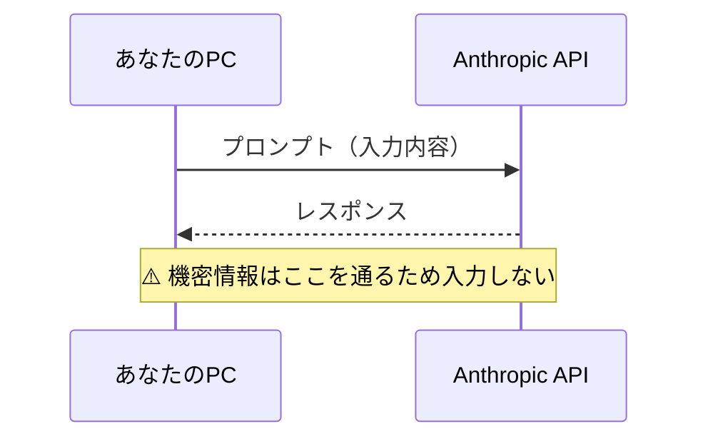
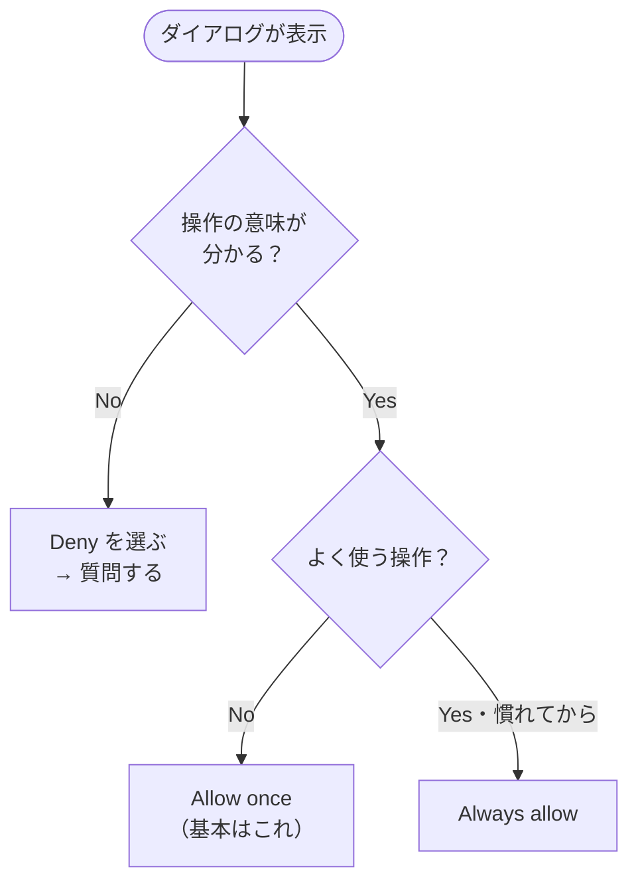
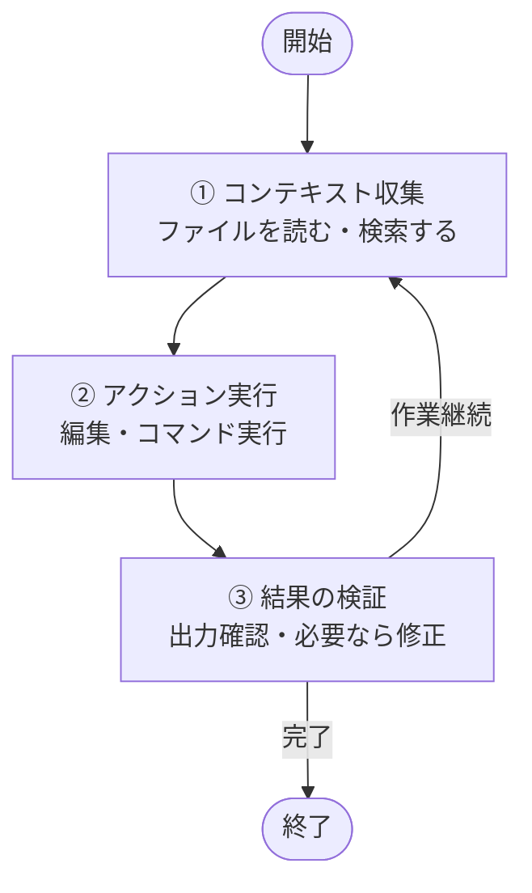
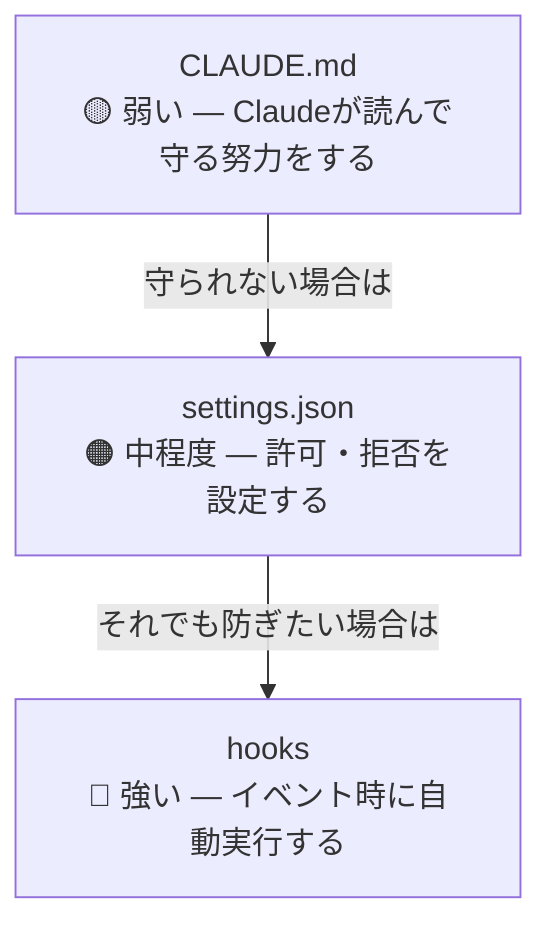

# Claude Code 個人向け 1Day 講義

> - **前提条件**: Windows または Mac のパソコン。講義当日までに下記「事前準備」を済ませ、`claude` と入力して Claude Code が起動する状態であること

---

## この講義でできるようになること

終了時に目指す状態:

1. Claude Code の基礎・基本を理解し、ファイル操作・各種コマンド・Skills / Hooks / サブエージェント・コンテキスト管理まで操作できる
2. AI 秘書（cc-secretary）を導入し、Lark CLI で自分の Lark アカウントと接続して操作できる（Base、Docs などの作成やカレンダー、タスクの読み取りなど）

## 1Day カリキュラム全体像

| ブロック | タイトル | 到達目標 |
|---|---|---|
| Session 1 | Claude Code の基礎・基本操作と設定 | 起動・ファイル操作・コマンド・Skills / Hooks / サブエージェント・コンテキスト管理を理解する |
| Session 2 | AI 秘書（cc-secretary）と Lark CLI | cc-secretary で AI 秘書を立ち上げ、Lark CLI で Base・Docs・カレンダー・タスクを操作できる |

---

## 事前準備

講義当日までに以下の 2 つの準備を済ませてください。

### ① Claude Code のインストール

以下の動画を参考に、Mac または Windows へのインストールを行ってください。  
Claude Code からメッセージが返ってくるところまで完了すれば OK です。

- **インストール動画**: [https://www.youtube.com/watch?v=_rskJ6I0H-s](https://www.youtube.com/watch?v=_rskJ6I0H-s)
- **文字起こし内容**: [https://mjpt22tawf9f.jp.larksuite.com/docx/LEiVdTiftoKEAuxkqABj16ZEph6](https://mjpt22tawf9f.jp.larksuite.com/docx/LEiVdTiftoKEAuxkqABj16ZEph6)

> [!IMPORTANT]
> Claude Code を使うには **Pro プラン（有料）以上** が必須です。  
> プランの詳細はこちら: [https://claude.com/ja-jp/pricing](https://claude.com/ja-jp/pricing)

### ② エディターのインストール

エディターに内蔵されたターミナルを使用するため、以下のいずれか **1 つ** をインストールしてください。

- **VS Code**
- **Cursor**
- **Antigravity IDE**

どれを選べばよいかわからない方は、こちらの参考記事をご覧ください:  
[https://zenn.dev/mitsuo119/articles/90c5c99eb64bd9](https://zenn.dev/mitsuo119/articles/90c5c99eb64bd9)

> [!NOTE]
> **Antigravity をお使いの方へ（Google I/O 2026 のアップデート情報）**
>
> Google I/O 2026 の発表により、Antigravity が **「Antigravity IDE」** という名前にアップデートされました。
>
> - これまでの「Antigravity」はチャット形式の AI エージェントに変わり、エディターとして利用できなくなります。
> - 強制アップデートされると、エディターとして利用できていたものがチャット形式に変わります。
>
> Antigravity をお使いの方は、以下のリンクから **Antigravity IDE** をダウンロードしてください。  
> [https://antigravity.google/download](https://antigravity.google/download)

### 準備チェックリスト

- [ ] Claude Code が起動する（`claude` コマンドを入力してメッセージが返ってくる）
- [ ] Claude Pro プラン以上のアカウントを用意した
- [ ] VS Code / Cursor / Antigravity IDE のいずれかをインストールした
- [ ] （Session 2 用・任意）Lark / Lark Suite アカウントにログインできる
- [ ] （Session 2 用・任意）Node.js（`npm` / `npx` が使える環境）を用意した（Lark CLI は講義中 §9 でインストール。cc-secretary より先に入れない）

---

## Session 1 — Claude Code の基礎・基本操作と設定

> **ゴール**: Claude Code の概要、安全な使い方、起動・ファイル操作、各種コマンド、Skills / Hooks / サブエージェント、コンテキスト管理を理解する

### Session 1 の到達目標

講義終了時点で、以下ができる状態を目指します。

- Claude Code とチャット AI の違いを説明できる
- 個人利用で入力してよい情報・避けるべき情報を判断できる
- `claude` を起動し、最初の対話ができる
- 許可ダイアログで `Allow once`、`Always allow`、`Deny` を選び分けられる
- 困った時に `Esc` や `/exit` で止められる
- ファイル作成、読取、追記、修正を実行できる
- エージェントループの基本を説明できる
- `/context`・`/compact`・`/clear`・`/resume` の使い分けができる
- Skills、Commands、Agents（サブエージェント）、Hooks の役割の違いを説明できる
- CLAUDE.md と `.claude/` の基本構成を理解できる

### 進行表

| 順番 | 内容 | 形式 |
|:---:|---|---|
| 1 | オープニング、講義全体像 | 講義 |
| 2 | Claude Code とは何か、個人で学ぶ理由 | 講義・対話 |
| 3 | 個人利用の安全ルール | 講義 |
| 4 | 起動、初回対話、許可ダイアログ、停止方法 | 実習 |
| 5 | チェックポイント、エージェントループ | 講義 |
| 6 | ファイル作成・読取・編集 | 実習 |
| 7 | CLAUDE.md、`.claude/`、Plan モード | 講義・実習 |
| 8 | Skills / Commands / Agents / Hooks | 講義 |
| 9 | コンテキスト管理、コマンドリファレンス、振り返り | 講義 |

### 1. Claude Code とは

Claude Code は、PC のターミナル上で動く AI エージェントです。普通のチャット AI が「文章で答える」ことを中心にするのに対し、Claude Code はファイルを読み、書き、編集し、コマンドを実行しながら作業を進めます。

|  | 普通のチャット AI | Claude Code |
|---|---|---|
| 動作環境 | ブラウザ | PC のターミナル |
| 主な使い方 | 相談、文章生成 | ファイル操作、作業実行、検証 |
| できること | 回答を返す | 読む、書く、直す、実行する |
| 育て方 | 毎回プロンプトを書く | 設定ファイルやスキルで継続的に育てる |

### 2. 個人で学ぶ理由

個人で Claude Code を学ぶ理由は、AI を「相談相手」から「作業の共同実行者」に変えるためです。

例

- メモや議事録から決定事項と次のアクションを抽出する
- ブログや報告のドラフトを作る
- フォルダ内の資料を読み、要点をまとめる
- 個人のタスク管理の仕組みを作る

重要なのは、最初から完璧な自動化を狙わないことです。Session 1 のゴールは、明日から 1 つの作業を Claude Code に任せてみるための土台を作ることです。

### 3. 個人利用の安全ルール

Claude Code はローカル PC 上で動作しますが、プロンプトとレスポンスは Anthropic の API を経由します（[セキュリティ](https://code.claude.com/docs/ja/security) / [プライバシーポリシー](https://docs.anthropic.com/ja/docs/legal-center/privacy)）。便利さより先に、何を入力してよいかの境界線を決めます。

#### 入力してよい情報

- 講義用のダミーデータ
- 公開済み情報
- 個人名や会社名を伏せた業務例
- 自分で外部 AI 利用を許可している文書

#### 入力して避けるべき情報

> [!CAUTION]
> 以下の情報は、原則として外部 AI へ送信しないでください。

- 他人の個人情報（本人の同意なく）
- クライアント名、契約金額、未公開案件
- パスワード、API キー、アクセストークン
- 勤務先で外部 AI 利用が禁止されている機密資料

#### ダミーデータ化の例

| 元データ | 置き換え例 |
|---|---|
| 株式会社ABC | クライアントA |
| 田中太郎 | 担当者A |
| 1,250万円 | 約1,000万円 |
| 新製品Xの未公開価格 | 新サービスの価格 |

#### 情報の流れ



### 4. Claude Code を起動する

ターミナルを開きます。

- Windows: PowerShell
- Mac: ターミナル

エディター（VS Code / Cursor / Antigravity IDE）に内蔵されたターミナルを使っても構いません。

```bash
claude
```

初回はブラウザが立ち上がり、サインイン画面が表示されます。サインイン後、ターミナルに戻ると Claude Code の入力欄が表示されます。

完了の目安

- ターミナル上に Claude Code の入力欄が表示される
- 文字を入力して送信できる
- Claude から返答が返ってくる

バージョン確認:

```bash
claude --version
```

### 5. 最初の対話

以下を入力してください。

```text
この講義では、Claude Code を個人の業務で安全に使う方法を学びたいです。
まず、今日の学習ゴールを3つに整理してください。
```

完了の目安

- Claude が 3 つの学習ゴールを返す
- 返答内容を読んで、分からない言葉を追加質問できる

### 6. 許可ダイアログ

Claude Code がファイル編集やコマンド実行を行う時、許可を求めることがあります。

| 選択肢 | 意味 | この段階での目安 |
|---|---|---|
| `Allow once` | 今回だけ許可 | 基本はこれ |
| `Always allow` | 今後も同じ操作を許可 | 頻出操作だけ慣れてから検討 |
| `Deny` | 拒否 | 意図しない操作なら選ぶ |

初回は、基本的に `Allow once` を選びます。意味が分からない操作が出たら、許可せず質問してください。



### 7. 止め方を覚える

AI を安全に使うために、始め方より先に止め方を覚えます。

| 操作 | 使う場面 |
|---|---|
| `Esc` | 実行中の作業を止めたい |
| `Esc` 2 回 | 直前の編集を取り消したい |
| `/exit` | セッションを終了したい |

### 8. チェックポイント

Claude Code はファイル編集の前に**チェックポイント**を作成します。これは、セッション内で「直前の状態に戻す」ための仕組みです。§7 で覚えた `Esc` 2 回が、この巻き戻し操作の入口になります。

ポイント

- ファイル編集の失敗を戻したい時に使う
- `Esc` 2 回で巻き戻し操作に入れる
- 外部システムへの操作や送信済みの内容は戻せない
- 重要なファイルを扱う時は、作業前にコピーを残しておく

### 9. エージェントループとは

Claude Code は、目的に向かって以下の流れを繰り返します。



普通のチャット AI は「質問に答える」だけで止まります。Claude Code は、作業が終わるまで次の手を考えます。ただし、あなたもループの一部です。途中で止める、方向修正する、許可しない、という判断を必ず行います。

> [!NOTE]
> ここでの「コンテキスト収集」は、作業に必要な情報を集める手順です。後述の「コンテキストウィンドウ」は、AI に一度に渡せるテキスト全体の容量を指します。語は似ていますが、別の概念です。

### 10. 作業フォルダを用意する

講義用フォルダを作り、その中で Claude Code を起動します。

```bash
mkdir claude-code-personal
cd claude-code-personal
claude
```

すでにフォルダを作っている場合は、そのフォルダで起動してください。

### 11. 対話で設計する

いきなりファイルを作らず、まず設計を依頼します。

```text
このフォルダで自己紹介ファイル about-me.md を作りたいです。
担当業務・得意分野・今取り組んでいることを含む構成案を提案してください。
まだファイルは作らず、構成案だけ出してください。
```

完了の目安

- 構成案が返ってくる
- ファイルはまだ作成されていない
- 「まず設計、その後に作成」という流れを体験できる

### 12. ファイルを作る

構成案を確認したら、ファイル作成を依頼します。

```text
その構成案で about-me.md を作成してください。
内容は講義用のダミーデータで構いません。
```

許可ダイアログが出たら、内容を確認して `Allow once` を選びます。

完了の目安

- `about-me.md` が作成される
- ファイル内容を開いて確認できる

### 13. ファイルを読む

```text
about-me.md の内容を読んで、改善できる点を3つ挙げてください。
まだ編集はしないでください。
```

完了の目安

- Claude が既存ファイルを読んでいる
- 改善提案が具体的に返ってくる
- 編集前に確認できる

### 14. ファイルを書き換える

```text
提案のうち、読みやすくする改善だけ反映してください。
変更後に、どこを変えたかを簡単に説明してください。
```

完了の目安

- ファイルが更新される
- 変更内容の説明が返る
- 自分でファイルを開いて確認できる

### 15. メモファイルを要約する

次に、業務に近いファイルを扱います。

```text
meeting-memo.txt を作って、以下の内容を書いてください。

日時: 2026年5月1日 14:00
出席者: 担当者A、担当者B、担当者C
議題: Q2 の計画見直し
決定事項: 来月から週次で進捗確認を実施する
担当: 担当者A
```

続けて、要約を依頼します。

```text
meeting-memo.txt を読んで、決定事項、担当者、次のアクションに分けて整理し、meeting-summary.md として保存してください。
```

完了の目安

- `meeting-memo.txt` と `meeting-summary.md` が作成される
- 元情報と要約の対応関係を確認できる

### 16. CLAUDE.md — プロジェクトのメモリ

CLAUDE.md は、Claude Code に対する永続的な指示書です。プロジェクトのルートに置くと、起動時に自動で読み込まれます。

```markdown
# プロジェクトルール

- 常に日本語で応答してください
- 報告書は「ですます調」で作成してください
- 機密情報をファイル名に含めないでください
- 不明点がある場合は、作業前に確認してください
```

ポイント

- 抽象的な精神論より、具体的で検証可能な指示を書く
- 長すぎると毎回の読み込み負荷になるため、200 行以内を目安にする
- 200 行を超えそうなら `.claude/rules/` に用途別で分割する
- 特定フォルダだけに効かせるルールは `paths` で対象を限定できる（触っていないときはコンテキストに載らない）

#### CLAUDE.md のスコープ

| スコープ | 場所 | 共有範囲 |
|---|---|---|
| プロジェクト共通 | `./CLAUDE.md` | このプロジェクト全員（Git 管理） |
| 個人×プロジェクト | `./CLAUDE.local.md` | 自分だけ |
| 個人×全プロジェクト | `~/.claude/CLAUDE.md` | 自分だけ、全プロジェクト |

#### CLAUDE.md を作る実習

```text
このフォルダに CLAUDE.md を作成してください。
以下のルールを含めてください。

- 常に日本語で返答する
- 講義中は実在の顧客名・個人名を使わない
- ファイルを編集する前に、何を変更するか簡単に説明する
```

続けて、挙動確認をします。

```text
このプロジェクトのルールを教えてください。
```

または `/init` で雛形を自動生成することもできます。

完了の目安

- CLAUDE.md が作成される
- Claude がルールを読み取って説明する

### 17. プロジェクトルートと `.claude/` ディレクトリ

Claude Code の設定は、**プロジェクトルート**と **`.claude/` 配下**に置きます。

```text
my-project/
├── CLAUDE.md              # 共有ルール（Git 管理）
├── CLAUDE.local.md        # 個人用（.gitignore 推奨）
├── .mcp.json              # MCP 定義（任意。本講義の Lark 操作は Lark CLI を使用）
└── .claude/
    ├── settings.json      # 権限・フックなど動作設定
    ├── settings.local.json
    ├── skills/            # 定型手順（1 スキル 1 フォルダ、SKILL.md）
    ├── commands/          # 旧形式（後方互換）。新規は skills/ を推奨
    ├── agents/            # サブエージェント定義
    ├── rules/             # CLAUDE.md の分割・パス特化ルール
    └── hooks/
```

### 18. お願いとガード（CLAUDE.md / settings / hooks）

| 書く場所 | 強制力 | 例 |
|---|---|---|
| CLAUDE.md | 弱い。Claude が読んで守る努力をする | 報告書は日本語で |
| settings.json | 中程度。許可や拒否を設定する | 危険なコマンドを拒否 |
| hooks | 強い。イベント時に自動実行する | 編集後にフォーマット |



`CLAUDE.md` は自然言語のルール、`settings.json` は権限やフックなどマシン向けの設定です。同じ内容を両方に書かないようにします。

#### 設定の優先順位（参考）

| 強い ← → 弱い | 内容 |
|---|---|
| Managed settings | 組織配布の設定（法人利用時） |
| 起動時の CLI オプション | 一時的な上書き |
| `.claude/settings.local.json` | 個人・このプロジェクトのみ |
| `.claude/settings.json` | このプロジェクト |
| `~/.claude/settings.json` | 全プロジェクト共通 |

### 19. Plan モード

大きな作業を任せる時は、いきなり編集させず、まず計画だけ作らせます。

| 方法 | 操作 |
|---|---|
| キーボード | プロンプト欄で `Shift + Tab` を 2 回押す |
| 単発指示 | プロンプトの先頭に `/plan` |

Plan モードでは、読み取りと調査だけを行い、編集は承認後に進めます。慣れるまでは、Plan モードを標準にすると安全です。

### 20. Skills / Commands / Agents / Hooks

| 部品 | 役割 | 使いどころ |
|---|---|---|
| Skills | 手順・知識のパッケージ（`.claude/skills/各フォルダ/SKILL.md`）。**新規はこちらを推奨** | 議事録整理、資料レビューなど |
| Commands | 短い定型プロンプト（`.claude/commands/*.md`） | `/review` のような 1 行コマンド |
| Agents | 専門家として**別コンテキスト**で作業（サブエージェント） | 調査、レビュー、テスト |
| Hooks | イベント駆動で自動実行 | 編集後の整形、危険操作の検知 |

#### Skills と Agents（サブエージェント）の使い分け

| | Skills | Agents（サブエージェント） |
|---|---|---|
| イメージ | 今の Claude への**手順書** | **別コンテキスト**で動く専門担当 |
| 使うとき | やり方・手順を教えたい | 調査・レビューを丸ごと任せたい |
| コンテキスト | メインの会話に載る | メインの文脈を節約できる |

初回導入では、まず CLAUDE.md から始め、定型手順が必要になったら Skills を追加します。Agents、Hooks は運用が増えてから段階的に導入します。

#### サブエージェントを使う例

```text
このリポジトリの README を読んで、改善点を3つ挙げてください。
調査はサブエージェントに任せ、結果だけ要約して返してください。
```

長い探索や調査はサブエージェントに任せると、メインのコンテキストを節約できます。

### 21. コンテキストウィンドウ

会話履歴、読み込んだファイル、コマンド結果、CLAUDE.md は、すべて**コンテキストウィンドウ**に載ります。作業机の例えで言えば、机の上に載せられる資料の総量です。載せすぎると重要な情報が埋もれ、返答の質が落ちることがあります。

#### 対処の流れ

長時間の作業で調子が悪くなったときは、次の流れで対応します。

1. **`/context`** で使用量を確認する
2. 状況に応じてどちらかを選ぶ
   - **同じ作業を続ける** → **`/compact`** で会話を要約圧縮する
   - **別の作業に切り替える** → **`/clear`** で会話をリセットする

#### コンパクション（`/compact`）

会話履歴を要約してコンテキストを空け直す操作です。同じ作業を続けるときに使います。

1. `Esc` でタスクを中断
2. `/compact` を実行
3. 要約が完了したら作業を再開

`/clear` とは異なり、会話の流れを保ったまま容量だけ圧縮できます。

#### 会話をリセットする（`/clear`）

別のタスクに切り替えるときは `/clear` を使います。`CLAUDE.md` やプロジェクトの設定ファイルは残ったままです。

#### セッション再開（`/resume`）

前回のセッションを会話履歴ごと引き継いで再開します。ターミナルを閉じた後でも、前の文脈を復元できます。

#### 日常のコツ（予防）

- 長いファイルを一度に読みすぎない
- 調査や探索はサブエージェント（§20）に任せ、メインの文脈を節約する
- `CLAUDE.md` が長くなったら `.claude/rules/` 分割や `paths` による限定を検討する

### 22. コマンドリファレンス

#### 起動コマンド（ターミナルで実行）

| コマンド | 動作 |
|---|---|
| `claude` | Claude Code 起動 |
| `claude --version` | バージョン確認 |

#### セッション管理コマンド（Claude Code 起動後に入力）

| コマンド | 動作 |
|---|---|
| `/help` | ヘルプ表示 |
| `/exit` | セッション終了 |
| `/resume` | 直前のセッションを会話履歴ごと再開 |
| `/clear` | 会話履歴のリセット（別タスクに切り替えるとき） |
| `/context` | コンテキスト使用量の確認 |
| `/compact` | 会話を要約圧縮（`Esc` で中断してから実行） |
| `/model` | 使用モデルを切り替える |
| `/init` | プロジェクトに CLAUDE.md の雛形を自動生成 |
| `/plan` | Plan モードで計画のみ作成（編集は承認後） |

#### プラグインコマンド（Session 2 で使用）

| コマンド | 動作 |
|---|---|
| `/plugin marketplace add <owner/repo>` | マーケットプレイス追加 |
| `/plugin install <name>@<marketplace>` | プラグイン導入 |

### Session 1 の復旧手順

| 症状 | 原因候補 | 対応 |
|---|---|---|
| `claude: command not found` | 未インストール、PATH 未設定 | ターミナルを開き直す。[インストールのトラブルシューティング（日本語）](https://code.claude.com/docs/ja/troubleshoot-install) を参照 |
| ブラウザが開かない | 既定ブラウザの問題 | 表示された URL を手動で開く |
| サインインできない | アカウント未準備 | Pro プラン以上か確認 |
| 許可ダイアログで迷う | 操作内容が理解できていない | `Deny` して質問する |
| ファイルが作られない | 依頼文に「保存して」「作成して」がない | 依頼文を具体化する |
| 内容が期待と違う | 編集前確認が不足 | 「まだ編集せず、改善案だけ出して」と戻る |
| 返答が鈍くなる | コンテキストが満杯 | `/context` → `/compact` または `/clear` |

### Session 1 のフォロー

- 自分の業務で「AI に相談したい作業」を 3 つ書き出す
- そのうち、機密情報を含まずに試せる作業を 1 つ選ぶ
- 次回使う作業フォルダを作っておく
- Session 2 に向けて、Lark アカウントと Node.js（`npx`）の準備を確認しておく（Lark CLI のインストールは Session 2 の cc-secretary 完了後に行う）

---

## Session 2 — AI 秘書（cc-secretary）と Lark CLI

> **ゴール**: AI 秘書（cc-secretary）を立ち上げ、日常のタスク・メモ管理を行える。続けて [Lark CLI](https://github.com/larksuite/cli) のインストール・設定・基本操作を体験する

> [!NOTE]
> 本講義では **cc-secretary** プラグインを **AI 秘書** として扱います。インストール手順ではプラグイン名 `cc-secretary` をそのまま使います。

#### Session 2 の進め方（インストール順）

Session 2 では、次の **2 段階** の順で進めます。**Lark CLI より先に AI 秘書（cc-secretary）を必ず完了** してください。

| 順番 | ブロック | 節 | 内容 |
|:---:|---|---|---|
| **1** | AI 秘書 | §1〜§7 | cc-secretary のインストール → オンボーディング → 基本操作 |
| **2** | Lark CLI | §8〜§13 | Lark CLI のインストール → 設定 → Features・基本操作 |

事前準備では Node.js（`npx`）まで用意し、**Lark CLI 本体のインストールは §9 で行います**（講義前に先に入れない）。

### Session 2 の到達目標

講義終了時点で、以下ができる状態を目指します。

- AI 秘書（cc-secretary）の役割を説明できる
- cc-secretary をインストールし、`/secretary` で管理モードを起動できる
- オンボーディングで `.secretary/` を生成し、自分の業務カテゴリを設定できる
- タスク追加・今日のタスク・メモ・週次レビューなどの基本操作ができる
- AI 秘書を自分の業務に合わせてカスタマイズできる
- Lark CLI（[larksuite/cli](https://github.com/larksuite/cli)）をインストール・設定し、カレンダー・タスク・Docs・Base などの操作を体験できる

### 進行表

| 順番 | 内容 | 形式 |
|:---:|---|---|
| 1 | Session 1 の振り返り、安全ルール再確認 | 対話 |
| 2 | **【1】** AI 秘書とは、cc-secretary のインストール | 講義・実習 |
| 3 | **【1】** オンボーディング、基本操作 | 実習 |
| 4 | **【1】** 自分仕様に育てる、代替ワーク（ここまでで cc-secretary を完了） | 実習 |
| 5 | **【2】** Lark CLI のインストール・設定・Features | 講義・実習 |
| 6 | **【2】** Lark CLI の基本操作、Claude Code 連携 | 実習 |
| 7 | コマンドリファレンス、振り返り、フォロー | 講義 |

### 1. AI 秘書とは 【ブロック 1: cc-secretary】

**AI 秘書**（cc-secretary）は、タスク、メモ、予定、振り返りを Claude Code 上で扱うための仕組みです。目的は、単なる TODO 管理ではありません。日々の業務情報をファイルとして残し、後から Claude Code と一緒に整理・改善できる状態にすることです。

Session 1 で学んだファイル操作・CLAUDE.md・Skills の知識を前提に、「自分専用の秘書環境」を立ち上げます。

### 2. cc-secretary をインストールする

AI 秘書を使うには、まず cc-secretary プラグインを導入します。Claude Code のプロンプト欄で、1 行ずつ実行します。

```text
/plugin marketplace add Shin-sibainu/cc-secretary
```

続けて

```text
/plugin install secretary@cc-secretary
```

プラグインを有効化するため、再起動します。

```text
/exit
```

ターミナルで再度

```bash
claude
```

完了の目安

- `/secretary` が認識される
- エラーなく AI 秘書（管理モード）が起動する

### 3. AI 秘書でできること

cc-secretary は、Claude Code 上で動く業務秘書プラグインです。対話的なオンボーディングを通じて `.secretary/` フォルダを自動生成し、タスク・メモ・アイデア・週次レビューを一元管理できます。

#### 対応カテゴリ（14 種類）

| カテゴリ名 | 説明 |
|---|---|
| todos | デイリータスク管理 |
| inbox | クイックキャプチャ（常に含む） |
| ideas | アイデアの記録 |
| meetings | 議事録 |
| projects | プロジェクト管理 |
| clients | クライアント管理 |
| research | リサーチ・調査 |
| knowledge | ナレッジベース |
| reviews | 週次・月次レビュー（常に含む） |
| content-plan | コンテンツ企画（ブログ/YouTube/SNS） |
| journal | 日記・ジャーナル |
| reading-list | 読書リスト |
| debugging | デバッグログ |
| finances | 財務・経理 |

#### 使い方の例

`/secretary` を実行すると、AI 秘書が役割・日常・管理したい領域をヒアリングし、フォルダ構成を自動生成します。

```text
秘書: あなたの主な役割や職業を教えてください！
あなた: フリーランスのWebエンジニア

秘書: 典型的な1日の流れを教えてください。
あなた: 午前はコーディング、午後はクライアントMTG、夜にレビュー

秘書: どの領域を管理したいですか？
あなた: 1,2,3,7,11

秘書: 以下のフォルダ構成を作成します...（ツリー表示）
あなた: OK

→ .secretary/ フォルダが自動生成される
```

#### 日常の使い方

セットアップ後は `/secretary` で管理モードに入り、日本語で操作します。

```text
タスク追加 APIのエラーハンドリングを修正する
今日のタスク
メモ クライアントAの要望: 納期を2週間前倒ししたい
アイデア 週報作成を Claude Code で半自動化できないか検討する
調査 競合他社のオンボーディングフロー比較
週次レビュー
ダッシュボード
```

### 4. オンボーディング

```text
/secretary
```

AI 秘書からヒアリングが始まります。回答例

```text
個人でWeb制作とコンサルをしています。
午前は制作、午後は打ち合わせと資料作成が中心です。
管理したい領域は、タスク、メモ、アイデア、プロジェクト管理です。
```

完了の目安

- `.secretary/` が生成される
- 業務カテゴリや inbox が確認できる

### 5. 基本操作

```text
/secretary
```

タスクを追加

```text
タスク追加 来週の打ち合わせ資料を準備する
```

今日のタスクを確認

```text
今日のタスク
```

メモを取り込む

```text
メモ クライアントA の要望: 納期を2週間前倒ししたい。要件の再確認が必要。
```

完了の目安

- タスクが追加される
- 今日のタスクが表示される
- メモが inbox に入る

### 6. 自分仕様に育てる

カテゴリを追加します。

```text
カテゴリ追加 顧客対応
```

`.secretary/` を開き、構造を確認します。

- カテゴリごとのフォルダ
- `inbox/`
- `reviews/`
- タスクやメモの保存先

続けて、CLAUDE.md に業務ルールを追記します（Session 1 で作成したファイルに追記して構いません）。

```markdown
# AI 秘書ルール

- タスクは「高・中・低」の優先度で分類する
- 顧客名は実名ではなく「クライアントA」のように匿名化する
- 週次レビューでは、完了・未完了・来週の重点を分ける
```

### 7. 代替ワーク: プラグインが使えない場合

ネットワークや端末設定により cc-secretary が使えない場合は、手動版 AI 秘書を作ります。

```text
このフォルダに manual-secretary というフォルダを作ってください。
中に以下のファイルを作成してください。

- tasks.md
- inbox.md
- weekly-review.md
- rules.md

tasks.md には「今日」「今週」「いつか」の3区分を作ってください。
inbox.md はメモ置き場にしてください。
weekly-review.md は週次振り返り用のテンプレートにしてください。
rules.md には秘書運用ルールを書いてください。
```

完了の目安

- `manual-secretary/` が作成される
- プラグインなしでも秘書ワークを継続できる

### 8. Lark CLI とは 【ブロック 2: Lark CLI】

> [!IMPORTANT]
> **ここからブロック 2 です。** §1〜§7 で cc-secretary（AI 秘書）のインストールと基本操作が終わっていることを確認してから進めてください。Lark CLI は **cc-secretary の後** にインストールします。

[Lark CLI](https://github.com/larksuite/cli)（`lark-cli`）は、Lark / 飛書の **公式 CLI ツール** です。人間がターミナルから直接使うだけでなく、**Claude Code などの AI Agent** が Lark の各種 API を安全に呼び出すために設計されています。

| 特徴 | 内容 |
|---|---|
| カバー範囲 | メッセンジャー、Docs、Base、Sheets、カレンダー、メール、タスク、会議など **18 業務ドメイン** |
| コマンド数 | **200+** の厳選コマンド |
| AI 向け Skill | **26** の Agent Skill（`lark-calendar`、`lark-doc`、`lark-base` など） |
| ライセンス | MIT（`npm install` で利用開始可能） |
| 設計思想 | Agent 向けに最適化（簡潔な引数、スマートデフォルト、構造化出力） |

cc-secretary が **ローカルファイル** で秘書業務を担うのに対し、Lark CLI は **Lark クラウド上の業務データ**（予定、タスク、ドキュメント、表など）にアクセスします。講義では **Lark CLI を標準手段** として使います。

> [!IMPORTANT]
> Lark CLI はあなたの Lark 権限の範囲で API を実行します。**`--as user`** で本人認証し、他人のデータを無断操作しないでください。機密情報は Session 1 と同様、入力前に匿名化してください。

### 9. Lark CLI のインストール

#### 前提環境

| 項目 | 要件 |
|---|---|
| Node.js | `npm` / `npx` が使えること（**推奨インストール方法で必須**） |
| Go / Python | ソースからビルドする場合のみ（Go `v1.23`+、Python 3） |
| Lark アカウント | Lark Suite / 飛書にログインできること |

#### インストール方法（いずれか 1 つ）

**方法 1 — npm からインストール（推奨）**

```bash
npx @larksuite/cli@latest install
```

**方法 2 — ソースからビルド**

```bash
git clone https://github.com/larksuite/cli.git
cd cli
make install
```

ソースビルドの場合は、Claude Code 連携用の Skill も追加します。

```bash
npx skills add larksuite/cli -y -g
```

#### Agent Skill のインストール（Claude Code 連携用）

Claude Code から Lark を操作するには、公式リポジトリ付属の **Agent Skills** を入れておきます。npm インストール後、次を実行します。

```bash
npx skills add larksuite/cli -y -g
```

`-g` はグローバル配置です。講義用プロジェクトだけに置く場合は `-g` を外し、プロジェクト直下で実行してください。

#### インストール確認

```bash
lark-cli --version
```

バージョンが表示されれば OK です。

### 10. Lark CLI の設定

インストール後、**アプリ認証情報の登録** と **ユーザー OAuth ログイン** の 2 段階が必要です。

#### 10-1. アプリ認証情報（初回のみ）

対話形式で Lark 開発者アプリの設定を行います。

```bash
lark-cli config init
```

ブラウザが開き、ガイドに従ってアプリを作成・認証します。完了すると `app_id` / `app_secret` がローカルに保存されます。

> [!NOTE]
> Claude Code に設定を任せる場合は、バックグラウンドで `lark-cli config init --new` を実行し、表示された **認証 URL をそのまま** ブラウザで開いてもらう運用も可能です。URL は改変せずコピーしてください。

#### 10-2. ユーザーログイン（OAuth）

自分の Lark データにアクセスするため、ユーザー本人としてログインします。

```bash
lark-cli auth login --recommend
```

`--recommend` は、よく使うスコープをまとめて承認するオプションです。講義ではこれを使うのが簡単です。

その他のログイン例

```bash
# 対話式（ドメイン・権限を TUI で選択）
lark-cli auth login

# ドメインを絞る（カレンダーとタスクだけ、など）
lark-cli auth login --domain calendar,task

# 特定スコープを指定
lark-cli auth login --scope "calendar:calendar:read"
```

#### 10-3. ログイン状態の確認

```bash
lark-cli auth status
```

現在のログインユーザーと付与済みスコープが表示されれば成功です。

#### 認証コマンド一覧

| コマンド | 動作 |
|---|---|
| `auth login` | OAuth ログイン（スコープ付与） |
| `auth logout` | ログアウト・認証情報削除 |
| `auth status` | ログイン状態・スコープ確認 |
| `auth check` | 特定スコープの有無確認（0=OK、1=不足） |
| `auth scopes` | アプリで利用可能なスコープ一覧 |
| `auth list` | 認証済みユーザー一覧 |

#### ユーザー / Bot  identity の切り替え

| 身份 | フラグ | 用途 |
|---|---|---|
| ユーザー | `--as user`（デフォルト想定） | 自分のカレンダー、Docs、タスクなど |
| アプリ（Bot） | `--as bot` | アプリ名義のメッセージ送信など |

講義では **個人の Lark データ** を扱うため、基本は **`--as user`** です。

### 11. Features — Lark CLI でできること

公式リポジトリの [Features](https://github.com/larksuite/cli#features) より、講義で特に使う領域を抜粋します。詳細はリポジトリの README を参照してください。

| カテゴリ | 主な能力 |
|---|---|
| 📅 カレンダー | 予定の閲覧・作成・更新、参加者招待、会議室検索、招待への RSVP、空き時間・候補時間の確認 |
| 💬 メッセンジャー | メッセージ送信・返信、グループ作成・管理、履歴・スレッド閲覧、検索、メディアのダウンロード |
| 📄 Docs | ドキュメントの作成・読取・更新・検索、メディア・画板の読み書き |
| 📁 ドライブ | ファイルのアップロード・ダウンロード、Docs / Wiki の検索、コメント管理 |
| 📝 Markdown | ドライブ上の `.md` ファイルの作成・取得・部分更新・上書き |
| 📊 Base（多维表格） | 表・フィールド・レコード・ビュー・ダッシュボード・ワークフロー・フォーム・権限、集計・分析 |
| 📈 Sheets（电子表格） | スプレッドシートの作成・読取・書込・追記・検索・エクスポート |
| 🖼️ スライド | プレゼンの作成・管理、内容読取、スライドの追加・削除 |
| ✅ タスク | タスクの作成・検索・更新・完了、リスト・サブタスク・コメント・リマインダー |
| 📚 Wiki | ナレッジスペース・ノード・ドキュメントの管理 |
| 👤 連絡先 | 名前・メール・電話でのユーザー検索、プロフィール取得 |
| 📧 メール | メールの閲覧・検索・送信・返信・転送、下書き、新着監視 |
| 🎥 会議 | 会議録の検索、議事録・録画などの成果物取得 |
| 🕐 勤怠 | 自分の打刻記録の照会 |
| ✍️ 承認 | 承認タスクの照会、承認・却下・転送、インスタンスのキャンセル・CC |
| 🎯 OKR | OKR の照会・作成・更新、目標・KR・進捗の管理 |

#### 3 層のコマンド体系

Lark CLI は用途に応じて 3 段階の粒度で API を呼び出せます。

| 層 | 形式 | 特徴 |
|---|---|---|
| 1. Shortcuts | `+` プレフィックス（例: `calendar +agenda`） | 人間・AI 向け。スマートデフォルト、表形式出力 |
| 2. API Commands | `lark-cli calendar calendars list` など | OAPI メタデータから自動生成。100+ コマンド |
| 3. Raw API | `lark-cli api GET /open-apis/...` | 2500+ API を直接呼び出し |

講義ではまず **Shortcuts（`+` コマンド）** から慣れるのがおすすめです。

#### 公式 Agent Skills（抜粋）

Claude Code 連携時に参照される Skill の例です（全 26 種。詳細は [GitHub README](https://github.com/larksuite/cli#agent-skills)）。

| Skill | 説明 |
|---|---|
| lark-shared | 設定・認証・身份切替・スコープ（他 Skill の共通基盤） |
| lark-calendar | 予定の作成・更新、agenda 表示、空き時間、会議室、RSVP |
| lark-im | メッセージ送受信、グループ、検索、ファイル |
| lark-doc | Docs の作成・読取・更新・検索（Markdown ベース） |
| lark-drive | ファイルのアップロード・ダウンロード、権限・コメント |
| lark-base | 表・フィールド・レコード・ビュー・集計 |
| lark-task | タスク・リスト・サブタスク・リマインダー |
| lark-sheets | スプレッドシート操作 |
| lark-mail | メールの閲覧・送信・下書き |
| lark-wiki | ナレッジベース |
| lark-workflow-standup-report | 日程と未完了タスクのサマリー（ワークフロー） |

### 12. Lark CLI の基本操作

設定とログインが済んだら、ターミナルで Shortcuts を試します。副作用のある操作は、先に `--dry-run` で確認できます。

#### カレンダー — 今日の予定

```bash
lark-cli calendar +agenda --as user
```

#### タスク — 自分のタスク一覧

Claude Code に次のように依頼するか、Skill 経由で実行します。

```text
lark-cli を使って、自分に割り当てられている未完了タスクを一覧してください。
```

#### Docs — ドキュメント作成（Shortcut 例）

```bash
lark-cli docs +create --api-version v2 --doc-format markdown --content $'<title>講義メモ</title>\n# 本日の要点\n- Session 1: Claude Code 基礎\n- Session 2: AI 秘書と Lark CLI'
```

#### Base — 表の操作

```text
lark-cli を使って、個人用の Base 表を新規作成し、
列は「タスク名」「期限」「状態」にしてください。
```

#### 出力形式（参考）

| オプション | 用途 |
|---|---|
| `--format json` | 機械可読（デフォルト） |
| `--format pretty` | 人間向け整形 |
| `--format table` | 表形式 |
| `--format ndjson` | パイプ連携用 |

### 13. Claude Code から Lark CLI を使う

講義のゴールは「ターミナルで打つ」だけでなく、**Claude Code が Lark CLI を実行して業務を進める** ことです。

#### 連携の流れ

1. §1〜§7 で **cc-secretary（AI 秘書）を先に完了** する
2. §9 で `lark-cli` と Agent Skills をインストール
3. §10 で `config init` と `auth login --recommend` を完了
4. 自然言語で依頼 → Claude が `lark-cli` コマンドまたは Skill を実行

#### Claude Code への依頼例

```text
lark-cli calendar +agenda を実行して、今日の予定を表形式で要約してください。
```

```text
Lark の未完了タスクを確認し、期限が近いものを3件ピックアップしてください。
```

```text
「Claude Code 講義メモ」というタイトルで Lark Docs を新規作成し、
本日の学習要点を3行で書き込んでください。操作前に --dry-run で確認してもよいです。
```

完了の目安

- `lark-cli auth status` が成功する
- `calendar +agenda` で予定が表示される（または Claude 経由で同等の結果が得られる）
- Docs または Base の操作を 1 回以上体験できる
- 権限エラー時に `auth login` の再実行手順を説明できる

> [!CAUTION]
> Lark CLI は AI Agent から自動実行されるため、プロンプトインジェクション等のリスクがあります。公式 README の [Security](https://github.com/larksuite/cli#security--risk-warnings-read-before-use) を読み、デフォルトのセキュリティ設定を安易に緩めないでください。

### 14. AI 秘書と Lark CLI の使い分け

| 用途 | AI 秘書（cc-secretary） | Lark CLI |
|---|---|---|
| タスク・メモの日常キャプチャ | ◎ `.secretary/` に蓄積 | △ Lark タスクと連携する場合 |
| 週次振り返り・ローカル整理 | ◎ | △ |
| カレンダー・会議 | △ | ◎ `calendar +agenda` など |
| チーム共有の Docs / Base | △ | ◎ |
| オフライン・ローカル優先 | ◎ | × API 必須 |

両方を併用する例: 朝は `lark-cli calendar +agenda` で今日の予定を確認し、作業中のメモは AI 秘書の inbox に入れ、週末に `週次レビュー` と Lark のタスク一覧を照らし合わせる。

### 15. コマンドリファレンス（Session 2）

#### プラグインコマンド（AI 秘書）

| コマンド | 動作 |
|---|---|
| `/plugin marketplace add Shin-sibainu/cc-secretary` | AI 秘書のマーケットプレイス追加 |
| `/plugin install secretary@cc-secretary` | AI 秘書プラグイン導入 |

#### AI 秘書（cc-secretary）コマンド

| 操作 | 動作 |
|---|---|
| `/secretary` | AI 秘書の管理モード起動 |
| `タスク追加 〜` | TODO に追加 |
| `今日のタスク` | 今日のタスク一覧 |
| `メモ 〜` | inbox にクイックキャプチャ |
| `アイデア 〜` | アイデアファイル作成 |
| `週次レビュー` | 今週のまとめを生成 |
| `ダッシュボード` | 全カテゴリ俯瞰 |
| `受信箱整理` | inbox 整理支援 |
| `カテゴリ追加 〜` | 新カテゴリ追加 |

#### Lark CLI — セットアップ

| コマンド | 動作 |
|---|---|
| `npx @larksuite/cli@latest install` | Lark CLI のインストール（推奨） |
| `npx skills add larksuite/cli -y -g` | Agent Skills のインストール |
| `lark-cli config init` | アプリ認証情報の設定 |
| `lark-cli auth login --recommend` | ユーザー OAuth（推奨スコープ） |
| `lark-cli auth status` | ログイン状態の確認 |

#### Lark CLI — よく使う Shortcuts（例）

| コマンド | 動作 |
|---|---|
| `lark-cli calendar +agenda` | 予定の一覧（agenda） |
| `lark-cli docs +create ...` | Docs 新規作成 |
| `lark-cli im +messages-send ...` | メッセージ送信 |
| `lark-cli <service> --help` | 各サービスの Shortcut 一覧 |

### Session 2 の復旧手順

| 症状 | 対応 |
|---|---|
| `/plugin` が使えない | `claude --version` でバージョン確認 |
| プラグインを導入できない | §7 の手動版 AI 秘書に切り替える |
| `/secretary` が認識されない | `/exit` → `claude` で再起動 |
| `.secretary/` が見つからない | 作業フォルダを確認する |
| 実名を入れてしまった | すぐに匿名化して保存し直す |
| `lark-cli: command not found` | `npx @larksuite/cli@latest install` を再実行 |
| Lark で権限エラー | `lark-cli auth login --recommend` を再実行 |
| Lark の操作が失敗する | `lark-cli auth status` と `--as user` を確認 |
| `config init` が進まない | 表示 URL を改変せずブラウザで開く |

### Session 2 のフォロー

- 自分の業務カテゴリを 3 つ決め、AI 秘書に登録する
- タスクを 5 件登録し、1 日 1 回 `今日のタスク` を確認する
- `lark-cli calendar +agenda` で明日の予定を 1 回確認する
- AI 秘書の inbox に、講義後 1 週間で試したいことを 1 件メモする
